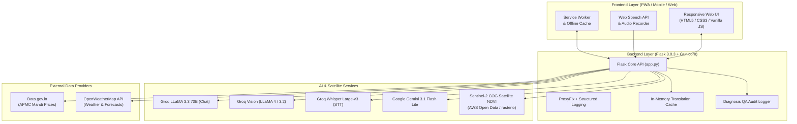

# 🌿 SmartAgro — AI-Powered Precision Agriculture Platform

<div align="center">

[](#)

<br/>

[](https://python.org)
[](https://flask.palletsprojects.com)
[](https://groq.com)
[](https://aistudio.google.com)
[](#-precision-agro-weather--satellite-ndvi)
[](https://huggingface.co/spaces)
[](https://web.dev/progressive-web-apps/)
[](LICENSE)
[](#)

**An intelligent, offline-capable agro-advisory ecosystem empowering Indian farmers with real-time mandi intelligence, ensemble AI crop diagnostics, Sentinel-2 satellite vegetation analytics, hyper-local weather alerts, and a multilingual voice assistant.**

</div>

---

## 🌟 Key Capabilities

### 🔬 Multi-Model AI Crop Disease Diagnostics & QA Pipeline
- **Ensemble Vision AI**: Multi-pass leaf and pest analysis powered by **Groq Vision (LLaMA 4 Scout & Maverick)** with optional cross-model verification via **Google Gemini 3.1 Flash Lite**.
- **Actionable Remediation**: Provides immediate disease identification, severity assessment, organic bio-pesticide treatments, chemical controls with exact dosages, and watering/soil advice.
- **QA & Accuracy Pipeline**: Persistent diagnostic logging with human expert verification workflow (`/api/diagnose-log/review`) and automated accuracy auditing metrics (`/api/diagnose-log/accuracy`).

### 📊 Real-Time Mandi Market Intelligence
- **Live Commodity Pricing**: Real-time mandi rates across **20+ major Indian APMC agricultural markets** integrated directly with `Data.gov.in`.
- **Market Trends & Filtering**: Interactive Chart.js trend visualizations (Line, Bar, Radar), demand-level filters (Very High to Low), price movement indicators (Rising/Falling), and live ticker bar.
- **Resilient Fallback**: Automatic failover to cached mandi trend data (`market_history_cache.json`) during upstream network outages.

### 🌤️ Precision Agro-Weather & Satellite NDVI
- **Hyper-Local Forecasts**: 7-day agricultural weather forecasts, hourly breakdowns, UV index, humidity, wind speeds, and precipitation tracking powered by OpenWeatherMap.
- **Live Satellite Vegetation Index (NDVI)**: Real-time Sentinel-2 Cloud-Optimized GeoTIFF (COG) NDVI calculation using `rasterio` and AWS Open Data, with calibrated agro-climatic estimation fallback.
- **AI Crop Advisory**: Dynamic crop recommendations tailored to current soil, moisture, and temperature conditions.

### 🔔 Agronomic Smart Risk & Pest Alerts
- **Climate-Driven Risk Engine**: Real-time evaluation of fungal, bacterial, and pest vulnerability based on temperature and humidity thresholds.
- **Extreme Weather Warnings**: Proactive alerts for heatwaves, frost, unseasonal rainfall, and high winds.
- **Seasonal Calendars & Crop Risk Matrices**: Detailed Kharif, Rabi, and Zaid crop schedules, pesticide safety protocols, and crop-specific management plans.

### 🤖 Kisan Helper — Multilingual Voice & Chat AI
- **Voice-Enabled Assistant**: Powered by **Groq LLaMA 3.3 70B Versatile** and **Groq Whisper Large-v3 STT** for lightning-fast voice transcription and dialect-aware conversations.
- **23+ Indian Languages**: Comprehensive translation pipeline covering Hindi, Bengali, Telugu, Marathi, Tamil, Gujarati, Kannada, Malayalam, Punjabi, Odia, Assamese, Urdu, and more.
- **Domain-Tuned Context**: Answers farming queries, fertilizer schedules, government schemes (PM-KISAN, PMFBY), and market trends.

### 📱 Progressive Web App (PWA)
- **Installable Native Feel**: Seamless install on Android, iOS, and desktop with custom icons and splash screen.
- **Offline Reliability**: Service worker caching for offline access with dedicated offline advisory fallback (`offline.html`).

---

## 🏛️ System Architecture



---

## 🛠️ Tech Stack

| Domain | Technology / Library | Description |
|---|---|---|
| **Backend** | Python 3.11, Flask 3.0.3, Werkzeug | RESTful API server, proxy handling, and routing |
| **Server** | Gunicorn 21.2.0 | Production WSGI server (single worker, multi-threaded) |
| **AI LLM & Voice** | Groq API (`llama-3.3-70b-versatile`, `whisper-large-v3`) | Fast conversational AI and speech-to-text |
| **AI Vision** | Groq Vision + Google Gemini (`gemini-3.1-flash-lite`) | Ensemble multi-pass crop disease classification |
| **Earth Observation** | `rasterio`, `numpy`, Sentinel-2 COG | Satellite NDVI extraction and vegetation analytics |
| **Weather Data** | OpenWeatherMap API | Live weather observations and 7-day forecasts |
| **Mandi Market Data** | Data.gov.in API | Government APMC commodity price feeds |
| **Frontend** | HTML5, Modern CSS, Vanilla JavaScript | Responsive, lightweight, glassmorphic UI |
| **Visualizations** | Chart.js | Multi-view market trend graphs and radar charts |
| **PWA & Offline** | Web App Manifest, Service Worker | Native installation, cache management, offline mode |
| **Deployment** | Docker, Hugging Face Spaces | Containerized deployment on port `7860` |

---

## 📁 Project Structure

```
SmartAgro/
│
├── app.py                         # Main Flask application & all API routes
├── requirements.txt               # Python package dependencies
├── Dockerfile                     # Container specification (HF Spaces / Production)
├── LICENSE                        # MIT License
├── Readme.md                      # Project documentation
├── .env.example                   # Environment variable template
├── market_history_cache.json      # Offline/fallback APMC mandi price history
│
├── templates/                     # Jinja2 HTML Templates
│   ├── index.html                 # Main Dashboard & Live Weather/NDVI Overview
│   ├── diagnose.html              # AI Crop Disease Diagnosis & Remediation Hub
│   ├── market.html                # APMC Mandi Market Prices & Interactive Charts
│   ├── alerts.html                # Smart Weather, Pest, and Agronomic Alerts
│   └── offline.html               # PWA Offline Fallback Screen
│
└── static/                        # Static Assets
    ├── manifest.json              # PWA Manifest configuration
    ├── service-worker.js          # Service Worker caching & network fallbacks
    ├── css/                       # Modular Stylesheets
    │   ├── main.css               # Global tokens, typography, navigation, chatbot
    │   ├── dashboard.css          # Dashboard metrics, forecast & advisory styles
    │   ├── diagnose.css           # Camera/upload preview, diagnosis cards, remedies
    │   ├── market.css             # Market cards, commodity ticker, chart layouts
    │   └── alerts.css             # Alert badges, seasonal calendar, risk matrices
    ├── js/                        # Client-Side Application Scripts
    │   ├── main.js                # Navigation, theme toggle, PWA registration
    │   ├── dashboard.js           # Weather API integration, NDVI visualizer, crop tips
    │   ├── diagnose.js            # Image capture/upload, diagnosis API, QA actions
    │   ├── market.js              # Mandi data fetching, Chart.js rendering, filters
    │   ├── market_translate.js    # Commodity name translation helper
    │   ├── alerts.js              # Alert calculations, forecast risks, calendar tabs
    │   ├── kisan-helper.js        # Voice recording, STT, and AI chat widget
    │   └── translations.js        # Multilingual static dictionaries (23+ languages)
    └── icons/                     # PWA Icons
        ├── icon-192.png           # 192x192 App Icon
        └── icon-512.png           # 512x512 App Icon
```

---

## 🔌 API Reference

### 🌐 Pages & Health
| Method | Endpoint | Description |
|---|---|---|
| `GET` | `/` | Main Dashboard page |
| `GET` | `/diagnose` | AI Crop Disease Diagnosis page |
| `GET` | `/market` | APMC Mandi Market Prices page |
| `GET` | `/alerts` | Smart Weather & Agronomic Alerts page |
| `GET` | `/offline` | PWA Offline fallback page |
| `GET` | `/healthz` | Liveness health check endpoint |
| `GET` | `/readyz` | Readiness probe endpoint |

### 🌾 Agro-Intelligence & Satellite
| Method | Endpoint | Params / Body | Description |
|---|---|---|---|
| `GET` | `/api/weather` | `lat`, `lon` | Live weather, UV index, air quality, 7-day forecast |
| `GET` | `/api/ndvi` | `lat`, `lon` | Sentinel-2 satellite NDVI vegetation health index |
| `POST` | `/api/crop-recommendations` | `lat`, `lon`, `temp`, `humidity`, `weather` | AI-recommended crops based on real-time climate |

### 💰 Mandi Market Data
| Method | Endpoint | Params / Body | Description |
|---|---|---|---|
| `GET` | `/api/market` | `location` | Fetches live mandi prices across APMC markets |
| `GET` | `/api/debug-market` | — | Debug endpoint for inspecting market fetch status |

### 🔬 AI Diagnostics & QA Audit
| Method | Endpoint | Params / Body | Description |
|---|---|---|---|
| `POST` | `/api/diagnose` | Multipart form (`image`, `crop_hint`) | Multi-model ensemble crop disease diagnosis |
| `GET` | `/api/diagnose-log` | — | View audit history of past diagnoses |
| `GET` | `/api/diagnose-log/image/<file>` | `filename` | Retrieve stored QA diagnosis audit image |
| `POST` | `/api/diagnose-log/review` | `log_id`, `review_status`, `correct_label` | Submit expert ground-truth review on diagnosis |
| `GET` | `/api/diagnose-log/accuracy` | — | View accuracy analytics & model agreement rate |

### 🤖 AI Assistant & Speech-to-Text
| Method | Endpoint | Params / Body | Description |
|---|---|---|---|
| `POST` | `/api/chat` | `message`, `history`, `language` | Kisan Helper AI conversational advice (LLaMA 3.3 70B) |
| `POST` | `/api/stt` | Multipart form (`audio`) | Speech-to-Text audio transcription (Whisper Large-v3) |

### ⚠️ Agronomic Risk & Alerts
| Method | Endpoint | Params / Body | Description |
|---|---|---|---|
| `POST` | `/api/alerts` | `temp`, `humidity`, `rain`, `wind` | Instant climate-driven pest & weather risk assessment |
| `POST` | `/api/alerts-forecast` | `forecast` array | Multi-day forward-looking agronomic risk forecast |
| `POST` | `/api/monthly-alerts` | `month`, `state` | Month-wise seasonal crop risks and action items |
| `POST` | `/api/seasonal-alerts` | `season` (kharif/rabi/zaid) | Seasonal crop calendar and pest management guide |
| `POST` | `/api/crop-risk` | `crop_name`, `weather` | Crop-specific vulnerability and risk analysis |

### 🌐 Translation Services
| Method | Endpoint | Params / Body | Description |
|---|---|---|---|
| `POST` | `/api/translate-market` | `data`, `target_lang` | Translates live commodity & mandi records |
| `POST` | `/api/translate-market/clear` | — | Clears market translation memory cache |
| `POST` | `/api/translate-alerts` | `alerts`, `target_lang` | Translates dynamic alerts and weather warnings |
| `POST` | `/api/translate-dashboard` | `content`, `target_lang` | Translates dashboard cards & recommendations |
| `POST` | `/api/translate-diagnose` | `content`, `target_lang` | Translates diagnosis UI elements |
| `POST` | `/api/translate-diagnosis-result` | `result`, `target_lang` | Translates detailed diagnosis analysis & remedies |

---

## ⚙️ Environment Variables

Create a `.env` file in the root directory (or configure Space Secrets on Hugging Face):

```env
# ── Groq API Key (Required for AI Chat, STT, and Vision Diagnosis)
# Get a free key at: https://console.groq.com/keys
GROQ_API_KEY=gsk_your_groq_api_key_here

# ── Google Gemini API Key (Optional: adds second vision model for ensemble cross-validation)
# Get a free key at: https://aistudio.google.com/
GEMINI_API_KEY=your_gemini_api_key_here
GEMINI_DIAGNOSIS_MODEL=gemini-3.1-flash-lite

# ── OpenWeatherMap API Key (Required for weather & forecasts)
# Get a free key at: https://openweathermap.org/api
OPENWEATHER_API_KEY=your_openweather_api_key_here

# ── Data.gov.in API Key (Required for live Mandi prices)
# Get a free key at: https://data.gov.in/user/register
DATA_GOV_API_KEY=your_data_gov_api_key_here

# ── Server & Logging Settings
FLASK_DEBUG=0
LOG_LEVEL=INFO
# DIAGNOSIS_LOG_DIR=/path/to/persistent_logs  # (Optional: defaults to ~/SmartAgro_Logs)
```

---

## 🚀 Getting Started

### Prerequisites
- **Python 3.11+** installed
- **Git** installed

### 1. Clone & Set Up Virtual Environment

```bash
# Clone the repository
git clone https://github.com/saswata722-maker/SmartAgro.git
cd SmartAgro

# Create virtual environment
python -m venv venv

# Activate virtual environment
# On Linux / macOS:
source venv/bin/activate
# On Windows (PowerShell / CMD):
venv\Scripts\activate
```

### 2. Install Dependencies

```bash
pip install -r requirements.txt
```

> **Note on Satellite NDVI**: `rasterio` and `numpy` enable live Sentinel-2 GeoTIFF satellite NDVI math. If omitted or unavailable on your platform, SmartAgro automatically uses an intelligent agro-climatic estimation fallback without crashing.

### 3. Configure API Keys

```bash
cp .env.example .env
# Edit .env and supply your GROQ_API_KEY, OPENWEATHER_API_KEY, and DATA_GOV_API_KEY
```

### 4. Run the Application

```bash
python app.py
```

Open your browser and visit **`http://localhost:7860`** (or `http://127.0.0.1:7860`).

---

## 🐳 Running with Docker

```bash
# Build the Docker image
docker build -t smartagro .

# Run the container with your environment variables
docker run -p 7860:7860 --env-file .env smartagro
```

---

## 🚀 Hugging Face Spaces Deployment

1. Create a new Space on **[Hugging Face Spaces](https://huggingface.co/new-space)**.
2. Select **Docker** as the SDK.
3. Push this repository to your Space repository.
4. Go to **Settings → Variables and Secrets** and add your secrets:
   - `GROQ_API_KEY`
   - `OPENWEATHER_API_KEY`
   - `DATA_GOV_API_KEY`
   - `GEMINI_API_KEY` *(optional)*
5. Hugging Face will automatically build the `Dockerfile` and expose the application on port `7860`.

---

## 🔒 Security & Privacy
- **Zero API Key Leakage**: API credentials are read strictly from environment variables and are filtered out of structured logs.
- **Client-Side Privacy**: Camera frames and audio recordings are transmitted securely for processing and can be stored in an optional audit directory for accuracy calibration.
- **Resilient Fallbacks**: Graceful degradation handles external API rate limits or network outages without crashing the client interface.

---

## 📜 License

This project is open-source under the terms of the [MIT License](LICENSE).

---

<div align="center">

**Built with ❤️ for Indian Farmers 🌾**  
*Empowering agriculture through accessible, resilient, and intelligent technology.*

</div>
